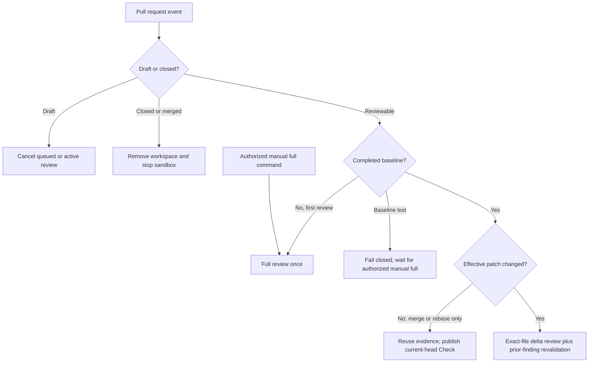

# Slop Sheriff


**Slop Sheriff** is a review-only GitHub App built as a standalone Eve
application. It runs on Vercel, uses Vercel AI Gateway for models, inspects pull
requests inside Vercel Sandbox, receives GitHub App events through Eve's native
GitHub channel, and publishes aggregate and per-axis Checks, one visible result
summary, and stable inline finding threads through the official Chat SDK GitHub
adapter's typed Octokit surface.

[Meet the sheriff](https://slop-sheriff.dev) · [Self-hosting instructions](docs/install.md)

Run your own sheriff on your own Vercel, Gateway and Convex accounts. There is
no public hosted installation service.

## Lifecycle

The paths below are exclusive. A full review and a delta review never run in
parallel for the same event.



- A reviewable PR opened from the outset gets a trailing 10-minute debounce.
- A draft becoming ready starts its first full review immediately.
- New commits during the debounce reset it. A new event steers and cancels
  stale active Eve work.
- After the first successful full review, only semantic delta files are freshly
  reviewed. Every open Blocking/Important finding and relevant Improvement or
  Nitpick is revalidated; other presentation-only findings are carried forward.
- Merge and rebase SHA churn is compared by normalized effective patch. A
  semantic no-op does not call a model and does not start another review; it
  only creates or updates the required Check on the current head.
- A missing, malformed, or failed baseline never triggers an automatic
  replacement full review. A write/maintain/admin user can explicitly request
  one with `@slop-sheriff run full review`.
- A current-head failure with validated checkpoints retains a sanitized retry
  envelope. An authorized `@slop-sheriff continue` resumes only recorded
  missing stages in the same durable session; mismatched or ineligible state
  fails closed.
- Selected-finding outcomes are persisted separately from coordinator history.
  Typed application code merges them with the prior baseline and fresh finding
  content, injects trusted identity, derives stable IDs and the verdict, then
  stages the validated report beside the unchanged baseline before publication.
  A publication-only continuation retries GitHub directly without a model or
  completed review work.

One GitHub summary comment holds the authoritative versioned review state and
complete v2 findings artifact. Large state is compressed and, when needed, split
into immutable attachments saved before the summary pointer changes. Convex stores advisory,
repository-scoped cross-PR memory
through `@convex-dev/rag`; it never owns the current verdict, baseline, or
finding status. Recent matches remain individual while older matches collapse
to bounded semantic-cluster representatives after the repository has enough
review history. The GitHub state allows the next webhook to distinguish the
first review, an exact delta, a semantic no-op, and a lost baseline.

## Trusted repository configuration

The optional configuration is `.github/slop-sheriff.yml`. The app reads it
from the pull request's base commit SHA, never from the proposed head. It reads
`.github/known-good-review.yml` only when the new file is absent. An empty new
file uses defaults; an invalid one fails closed. Unknown keys or models also
fail closed.

```yaml
model: openai/gpt-5.6-sol
agents: moonshotai/kimi-k3
profile: balanced
blocking: false
personality: true
embedding: voyage/voyage-4
embeddingDimension: 1024
publicRoots:
  - website
```

`model` defaults to this ordered AI Gateway fallback chain:

- `openai/gpt-5.6-sol`
- `moonshotai/kimi-k3`
- `anthropic/claude-opus-5`

Any currently listed AI Gateway language model with tool use is accepted;
there is no model allowlist. Comma-separated IDs form an ordered fallback
chain. `agents` is optional: a string applies one chain to every subagent,
while a mapping can override project-owned review axes without creating a
second lane system. `scout` defaults to `openai/gpt-5.6-luna` with xhigh
reasoning and can be overridden like the axes:

```yaml
model: openai/gpt-5.6-sol, anthropic/claude-opus-5
agents:
  deduplication: moonshotai/kimi-k3, openai/gpt-5.6-sol
  claim-and-specification: anthropic/claude-opus-5
  engineering-quality: openai/gpt-5.6-sol
  discoverability: moonshotai/kimi-k3
  test-against-spec: openai/gpt-5.6-sol
  test-health: openai/gpt-5.6-sol
  writing-quality: openai/gpt-5.6-sol
  scout: openai/gpt-5.6-luna
```

Choose `voice: theatrical` (C, default), `voice: understated` (B), or
`voice: off`. `personality: false` also selects plain language. A trusted-base
`voiceGuide: docs/review-voice.md` can customize style without changing evidence,
severity, or the recommendation. Each finding has a 25 to 45 word introduction,
expandable evidence, applicable principle and fix direction, then visible Impact
(at most 300 characters) and one-sentence Risk. The whole comment stays within
200 words. With personality enabled, a compact robot portrait reacts to the
finding: alarmed for Blocking, skeptical for Important, inspired for Improvement,
and a cheeky wink for Nitpick. Both `voice: off` and `personality: false` hide it.
These are reusable images, with no image-generation calls during reviews.
See the [voice and visual guide](docs/brand.md).
The [validation record](docs/validation/slop-sheriff.md) includes comment
previews, policy measurements and the remaining real-model comparison work.

One broad core covers correctness, claims, reuse and test value. Triage selects
specialists from changed content, with reasons retained in coverage: behavior
changes get real-interface specification checks; public contracts, dependencies
and consequential risks receive focused additional review. Unknown or incomplete
patches widen coverage conservatively. A conditional test-health lane checks affected tests as frozen
consumer contracts: public outcomes, failure sensitivity and tolerance of
internal refactors. Discoverability is conditional on public web content; writing
quality activates for changed authored prose, strings or substantive comments. Specialist reports classify their scope and preserve failed and
unverified results. Supported defects from every lane are posted inline;
only actionable unrelated existing concerns appear in the main summary details. Before dispatch,
shared setup installs declared toolchains, locked dependencies and needed browser
components. Setup failure prevents review completion. Real external requirements
remain explicit limitations. Fixed bot threads receive a brief acknowledgement
and commit link, then resolve only with evidence matching the original finding.

The former `agents.commenter` key remains accepted for configuration
compatibility but is ignored; publication formatting is deterministic.

`profile` changes inline publication volume without changing review depth or
the canonical report. `focused` publishes Blocking and Important findings,
`balanced` also publishes Improvements, and `thorough` also publishes
Nitpicks. The default is `balanced`. Hidden Nitpicks remain visible in counts,
revalidation, telemetry, and repository memory.

Reviews are non-blocking by default. Set `blocking: true` to submit GitHub
`REQUEST_CHANGES` when an open Blocking or Important finding exists and
`APPROVE` otherwise. Improvements and Nitpicks never block.

`embedding` accepts any currently listed AI Gateway embedding model.
`embeddingDimension` must match that model's default output and one of Convex
RAG's supported vector sizes. The defaults are `voyage/voyage-4` and 1024.
Changing either value re-embeds the repository in a parallel namespace and
promotes it only after the replacement is ready.
Delta reviews reuse embeddings for unchanged finding text. Current finding
outcomes and provenance come from application records during retrieval.

`publicRoots` declares repository-relative public-content trees from the
trusted base. Discoverability also activates for explicit website, SEO,
landing, blog, legal, robots, sitemap, social-image, favicon, and icon paths.
Generic framework pages, API routes, schemas, manifests, and docs do not imply
publicness.

The coordinator and each invocation use one successful model. AI Gateway tries
only the explicitly listed fallbacks when the primary fails. Revalidation uses
the scalar `agents` chain when present; a per-axis map leaves revalidation on
the coordinator chain.

Each active review axis receives its own Check Run under `slop-sheriff`.
Existing `known-good-review` Checks and state remain readable during migration.
The old command names also remain accepted.

Axis Checks report
execution health only: in progress while working, success after complete
evidence coverage, skipped when a conditional axis does not apply, and
action-required when an active axis cannot complete. The aggregate Check owns
the configured blocking policy. Before lanes start, the app records one
immutable evidence ledger for the exact review. Its digest binds the patch
manifest, capability inventory, exact-head Checks, digest-validated workflow
artifact archives, shared repository history and memory, common probes, and
typed gap dispositions. Stable work identities make reuse observable. Every
attempt-zero axis starts concurrently after this application-owned preparation
and receives the same ledger digest and shared evidence. Artifact contents remain
untrusted data in the credential-free sandbox and are never executed. GitHub
presentation is derived deterministically from the validated v2 report without
another model call.
The publication tool accepts no report or target from the model. It loads only
the application-staged report after exact review identity validation.

Telemetry uses Eve's experimental instrumentation providers with input and
output capture disabled for every audience. Native model-call identities join
usage and Gateway metadata in durable session state. Session hooks own accounting,
Gateway reconciliation, publication, and recovery; they retain protocol usage
when a provider cannot record an observation. Cache-inclusive SDK totals and
Gateway-native accounting categories remain separate.

## Local development

Requirements are Bun 1.4.2 and the runtime prerequisites selected by Eve's
local sandbox backend. The project intentionally uses Bun for installs, scripts,
tests, and builds. Node 24 remains the deployment engine because that is the
current Eve/Vercel runtime contract. Only the latest stable Bun release is
supported, currently pinned in `packageManager`; CI reads that same pin.

```bash
bun install
bunx convex dev
bun run check
bun run replay:pr61
bun run dev
```

`bun run check` type-checks, runs the deterministic unit suite and provider-free
Eve session/delegation smoke test, inspects Eve's discovered surface, and builds
without provisioning a hosted sandbox snapshot.
It does not call a paid model. Convex code is also type-checked locally; a
Convex deployment is needed only to regenerate bindings or exercise HTTP
actions.

`bun run replay:pr61` validates all four recorded Pascal MCP SDK PR 61 runs
offline and prints phase-by-phase recorded and projected candidate timings,
worker consumption, stable common-work reuse, tokens, costs, finding
transitions, publication attempts, and recovery work. Its performance values
are measurements only and cannot stop, shorten, accept, or reject a review.

The production sandbox has GitHub-only egress, no repository credentials, and
one persistent Eve sandbox per PR session. Eve stops compute after each turn
while retaining the filesystem for later deltas. Close/merge cleanup removes
the inspected workspace and review evidence before stopping it, and reports
deletion failures instead of claiming success. Physical retention after stop is
owned by Vercel Sandbox; Eve's public runtime handle deliberately exposes
`stop()`, not a provider sandbox identifier that application code could safely
delete.

## External setup

Start with the [self-hosting instructions](docs/install.md), then use the
[deployment and live validation guide](docs/deployment.md) for rollout.

Provision your Connect-backed GitHub App with the documented Connect commands, create
the Convex deployment, deploy the app to Vercel, and install it on selected
repositories. Set `KNOWN_GOOD_REVIEW_EVIDENCE_KEY` in the app environment to
32 random bytes encoded as 64 hexadecimal characters. Keep it stable across
replicas and restarts, and never pass it into a repository sandbox. Evidence is
authenticated against this key, its exact path, and the root review session.
Existing unsigned sessions and sessions affected by key rotation need fresh
reviews. Missing or malformed keys reject review admission.

Give Convex its AI Gateway key and
the shared memory bearer token; give Eve the Convex HTTP-actions URL and the
same token. The app needs repository metadata read, contents write, Actions read,
pull requests read/write, issues read/write, and checks read/write. Forward
`pull_request`, `issue_comment`, `installation`, and
`installation_repositories` events through Connect to `/eve/v1/github`.

A GitHub API `401` evicts only the matching Connect token cache entry and
retries once through the native token resolver. A second `401`, a permission
failure, a network failure, or a rejected Connect exchange remains terminal.
Chat requests retain explicit installation scoping; Eve channel requests retain
the connector's default app context. Review admission retains its overall
deadline and does not force a new Connect exchange on every review.

The single GitHub route verifies installation lifecycle events with the same
Connect OIDC verifier as Eve. Before a review can later enqueue memory, it
captures a Convex admission receipt and then verifies that the installation
currently has access to the repository. Removal invalidates earlier receipts,
including reviews that have not written any memory yet. Revocation records
retain only installation/repository IDs, generations, and delivery IDs after
content deletion; they prevent delayed requests from recreating deleted memory.
Fresh authorized reviews can obtain a new receipt after repository re-addition.
A complete uninstall permanently revokes that installation ID; reinstalling
creates a different installation ID. Old sessions without a receipt can finish
publication but do not enqueue memory; start a fresh review to restore ingestion.

The authenticated Convex `/memory/delete` endpoint admits cleanup before the
webhook is acknowledged. Native GitHub delivery IDs make redelivery idempotent.
Forwarded requests without that header receive an application job ID, and every
repository-removal event rechecks current installation access before deleting.
An empty removal list reconciles both registered admissions and stored memory
against the remaining accessible repositories. Cleanup drains active writers,
deletes every RAG namespace version and its entries, then removes application
rows. Each job targets its original repository record; an 11-minute watchdog
retries abandoned cleanup without touching a replacement record.

Do not add a second Chat SDK webhook route. The decorated Eve route owns inbound
verification, lifecycle cleanup, durable PR sessions, checkout, and steering.
The Chat SDK adapter is the typed outbound publication boundary for Check Runs,
the result summary, inline finding threads, and installation-access API reads.

The repository and visible product are named Slop Sheriff. Existing Connect
identifiers, environment variable names, signed evidence paths, and durable
state markers remain compatible. Renaming the GitHub App registration is a
separate operational change; keep `GITHUB_BOT_USER_ID` pinned to that App
when changing its login. See [brand migration](docs/brand.md#operational-migration).

See [project lane authoring](docs/custom-lanes.md), [requirements and documentation checks](docs/requirements.md),
[comment examples in all three voice modes](docs/review-examples.md), [architecture](docs/architecture.md), [domain context](CONTEXT.md), and
[skill provenance](docs/skill-provenance.md).
