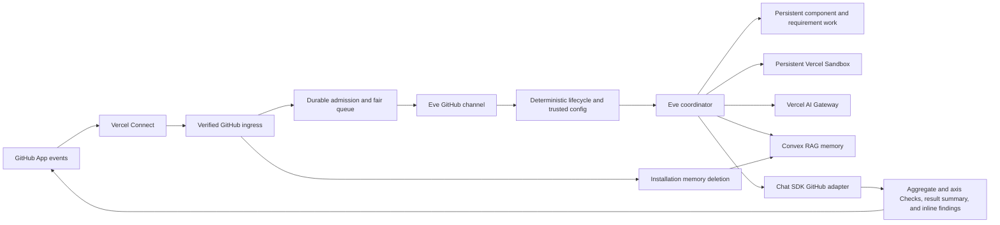

# Architecture

## Runtime boundaries

The native Eve GitHub route remains the only inbound webhook path. A thin route
decorator recognizes GitHub App installation lifecycle payloads, verifies them
with Eve's existing Connect OIDC verifier, and sends cleanup admission directly
to Convex. Verified review events are durably admitted before GitHub reads or
model work. A fair repository queue dispatches the current attempt through an
authenticated internal route into Eve. Attempt ownership fences execution and
publication. Newer heads supersede obsolete work; native cancellation and
reconciliation preserve accepted work without replaying a new review blindly.

The official Chat SDK GitHub adapter is instantiated with the same Connect
connector and a webhook-specific installation ID. This application uses its
typed Octokit escape hatch because GitHub Checks are not a generic chat
operation. It does not register the adapter's webhook route.

## Admission and dispatch

Verified webhook admission, the fair repository queue, current-head ownership,
trusted-base configuration and publication fencing remain application-owned.
Every reviewable update with a baseline takes the incremental path. An unchanged
effective patch alone cannot authorize republishing: changed supporting base code
or requirements may invalidate earlier evidence. Missing or corrupted canonical
state fails visibly. A known interrupted initial review retains its completed work
and can continue on a new head without a published baseline.

The current PR manifest supplies complete finding scope. A published baseline
preserves canonical findings and threads; it no longer determines which technical
investigations can be reused. Completed component assessments are stored as soon
as they finish, independently of the root report and GitHub publication.

## Review execution

`buildReviewWorkPlan` assigns one broad technical assessment per affected
component. Correctness, reuse, dependency value and design duplication share that
investigation. Independent requirement assessment and real-interface verification
remain separate from implementation analysis. Writing, test health, discoverability
and configured project specialists receive their selected surfaces and relevant
requirements. Every changed file retains core ownership. The final axis report
records application-selected exclusions without claiming they were probed.

A work unit has a stable identity, current source/requirement/policy inputs, a
signed packet, and an immutable completion. Input identity includes component
membership, exact base/head blobs, relevant configuration and requirements.
Additional source reads and searches record their dependencies, including negative
search scope. Shared probe receipts bind the actual command, input files,
toolchain, environment and output. Missing or changed proof requires fresh work;
a storage failure is an operational error, not an automatic paid cache miss.
Unknown historical contracts are retained only as context.

A subsequent fix receives the change since the previously assessed head, the
original claim, and previous observations. If that commit is unavailable, the
packet explicitly retains the original PR patch. Requirement assessments begin
with their source clauses and a file index rather than another copy of every
patch. Scope omission never proves verification. Missing installable tools must
be repaired and the required checks executed before completion.

Tracked tools provide exact source reads, shared executable probes, full output
paging, native public-document fetches and actual image inspection. Their current
observations are authenticated separately from cross-head reuse eligibility.
An explicit rerun, a disposable mutation experiment, or a live external observation
can be valid current evidence even when it is ineligible for later reuse. Shared
tests record one execution; each independent reviewer still judges the result
against its own frozen expectations. They may request different scenarios or
repeated execution to assess sensitivity and flakiness.

The Eve workflow consumes the prepared work plan. Reused completions require no
child call. Pending units share the worker capacity already reserved by durable
admission. A useful continuation retains its native child context; a stronger
model receives saved progress only when unresolved ambiguity or contradictory
evidence justifies an explicit escalation and the configured model/effort differs.
There is no model-step, token, duration or spending completion cutoff. Repeated
work without new evidence fails visibly and preserves its checkpoint.

Eve 0.52.5's workflow helper returns model output without the native agent handle.
The authenticated application route therefore reads recorded public Session events
and binds results to the actual root, invocation, child and turn. Dispatch intents
and child admission fences reject an unexpected fresh child during continuation,
including the installed helper's missing-agent fallback. Cancellation fences late
children before their first model call and drains admitted children. This uses
public Session APIs; authored `subagent.called` hooks do not receive workflow calls
in this installed version. Native smoke tests exercise this boundary.

Role-specific native tool resolution removes untracked filesystem and legacy lane
operations from assigned work children. The static workflow tool remains visible
because the installed Eve compiler does not support a dynamic workflow definition;
its executor rejects child invocation. Native tool-result hooks validate runtime
names and output schemas for dynamically wrapped tools.

Analysis writes plain technical facts. The coordinator receives candidates, failed
checks and conflicting observations for judgment. Application code combines full
scope, coverage, probes, churn and verified claims from the signed assessments;
the model does not transcribe ordinary passing evidence. It assigns justified
severity and writes the public explanation. Existing introductions can be rewritten
for the configured voice without changing their evidence, IDs, severity, lifecycle
or recommendation. The canonical assembly and GitHub staging contracts retain
prior-finding revalidation and stable threads.

The workflow cannot access a sandbox directly, so ordinary tools prepare and
validate the physical workspace. Signed evidence alone never proves that a restored
VM has the checkout or dependencies. The shared environment preparation, exact-head
GitHub artifact validation and credential-free repository sandbox remain in place.
Gateway receives the selected model and its ordered fallback chain. Task-specific
routing and quality/cost evidence are documented in
[review quality and lifecycle economics](validation/review-quality.md).

## Repository memory

Successful full and delta publication queues an idempotent Convex ingestion;
publication never waits for embedding completion. Convex schedules bounded
retries and stores normalized outcomes in an `@convex-dev/rag` namespace keyed
by immutable GitHub repository ID. Prompts, patches, source, model responses,
credentials, and probe output are never stored.

Repositories start in bootstrap mode. Adaptive short, mid, and long tiers
activate only after the confirmed age, review-count, review-day, and span
gates. Retrieval post-ranks semantic matches by recency tier, severity, open
state, and distinct-PR recurrence. New memories reuse their one generated
embedding for both RAG storage and nearest-cluster assignment. Later ingestions
reuse a ready RAG entry when its text hash and embedding configuration match.
Search joins its vector identity to current application records for outcome,
severity, timestamp and provenance; orphaned and superseded entries are excluded.
Older metadata-inclusive hashes are replaced on the next ingestion. Short-term
matches remain individual, mid-term retrieval keeps up to two representatives
per semantic cluster, and long-term retrieval keeps one. The clustering score
and tier caps live in the hashed memory policy for deterministic replay and
explicit tuning. A current review always owns the verdict.

An embedding-model change builds a pending RAG namespace while the active
namespace continues serving reads, then promotes the replacement atomically.
Pages and retries have durable job identities and an 11-minute expiry. Ready
ingestions on the active model drain before another migration claims work,
preventing queued configurations from repeatedly switching before ingestion.

Admission receipts come from a persistent installation/repository access record
created before a fresh native GitHub installation-access check. Removal advances
its generation before asynchronous cleanup. Ingestion requires the current
receipt; deleting content never deletes this revocation barrier. Re-adding a
repository permits a newly checked receipt, while a complete uninstall blocks
that installation ID. These access and delivery records contain identifiers
only. Previously running sessions without a receipt skip memory ingestion.
Access checks stop once the repository is found and have a five-second deadline;
full lifecycle reconciliation enumerates all pages within fifteen seconds.

Native delivery IDs deduplicate webhook redelivery. Headerless forwarded events
use an application job ID; current access is checked for every removal event.
Reconciliation pages through access registrations and stored repositories, so a
review registered before its first memory write is still revoked. Cleanup jobs
are bound to the original repository document ID and resume after abandoned
actions. They drain writers, delete every RAG namespace version through the
component's native API, then delete application rows. This also removes orphan
entries left by a crash between RAG insertion and saving the app's vector row.

## State and publication

An accepted model-backed review creates or updates an active current-head
aggregate Check and one Check per active axis as `in_progress`; conditional
axes are `skipped`. A rerun after completion creates fresh same-name Checks
because a completed run is terminal. Manual comment triggers receive an
eyes reaction from the webhook handler while it still owns the exact triggering
comment. Completion moves the active Check Run to its final verdict.

The validated report is written into `pendingPublication` before any visible
review is submitted. That state is bound to the exact trusted review identity
and coexists with the last successful baseline. A publication failure therefore
leaves the prior baseline intact and gives `@slop-sheriff continue` one
application-only operation: reload the staged report and retry GitHub. It does
not start an Eve coordinator turn, lane, or revalidation worker.

Every successful publication also updates one visible PR summary containing the
result and a hidden canonical state schema v2 artifact, baseline head,
whole-patch fingerprint, and per-file fingerprints. Findings use native inline
review threads at their exact diff locations. Hidden semantic fingerprints,
derived from the canonical cause, invariant, and remedy, own reconciliation;
`CR-N` is the readable canonical report identifier. Application-owned baseline
aliases preserve original thread hashes across trusted delta revalidation; full
reviews cannot borrow unrelated CR numbers. A verified fixed finding receives
a brief evidence-and-commit reply before its bot-owned thread resolves. Runtime
requirements survive deferred revalidation. Hidden or unmatched findings and
human threads stay open. Replacement threads are submitted before moved-thread
cleanup. Per-thread failures preserve staged state and prevent completion;
retries inspect existing replies and resolution state without repeating them.
Inline findings use one shared Markdown/HTML formatter: emoji headline,
severity, 25 to 45 word introduction, expandable evidence/principle/fix, Impact
of at most 300 characters, and one-sentence Risk. The complete comment is at most
200 words. Contextual voice comes from model-authored fields. The mutable current
summary separates recommendation from GitHub enforcement and only expands
additional actionable unrelated concerns. Check Runs and
the canonical artifact retain detailed evidence. Check lookup is scoped to the current head and
fixed aggregate and axis names.

State uses a single comment when it fits, gzip when necessary, then immutable
digest-addressed parts when compressed state needs multiple comments. Parts must
all exist before the summary pointer changes; failed writes preserve the previous
baseline, and retries reuse existing parts. Each comment is bounded to 65,000
bytes, serialized state to 8 MiB, and compressed storage to 64 parts of 60,000
characters. Invalid or oversized state and inline findings fail before advancing
the baseline. A completed or failed Eve
turn that did not publish a validated artifact becomes a failed Check; a known interrupted initial review preserves its component completions for
validated recovery. Corrupted canonical state remains fail-closed.

A current-head failure also records a bounded, sanitized envelope beside the
unchanged successful baseline. It binds the failed stage and completed axes to
the trusted base, head, effective patch, plan, session, turn, and recovery
revision. Schema failures retain bounded issue codes and field paths without
input values. Authorized continuation reuses only matching durable state and
lane checkpoints; token-limit failures remain ineligible.

## Sandbox and telemetry

The Vercel/microsandbox backends allow GitHub and public dependency/toolchain
download domains, with private IPv4 ranges denied. Docker fallback is offline because it cannot broker per-domain
credentials. GitHub checkout authentication stays in the firewall; no token is
placed in the sandbox.

Eve caches bootstrap tools in its sandbox template. Exact-head preparation
serializes checkout and dependency setup for the shared sandbox, removes stale
ignored dependencies, installs declared runtimes and locked packages, and checks
browser startup when required. Its receipt binds the head, declaration hashes,
completed steps and observed versions into capability evidence. Setup failures
stop dispatch; missing installable tools are not successful coverage gaps. The
runtime revision key replaces stale templates when the bootstrap changes.

Each turn stops sandbox compute. The durable filesystem is resumed for the
next delta. A close/merge operation removes `/workspace` contents and stops the
sandbox. The GitHub state artifact remains so review history is auditable.

OpenTelemetry inputs and outputs are disabled. Eve emits its normal structural
run tags, while the metadata hook records Gateway generation model/provider,
tokens, cache tokens, exact USD cost, generation time, latency, outcome, and
review kind. Offline replay deduplicates measurements by Agent Run, session,
and generation identity, then compares recorded and candidate phases without
using any measurement as an acceptance gate. Generation lookup failures are
visible but do not expose prompts or source. Each metadata request has a
five-second timeout; unresolved records remain pending. Completed, failed and
cancelled turns release their transient tracking and flush observed usage.

The application uses Eve's native root input quota: 40,000,000 provider-reported
tokens in installed Eve 0.52.5. The separate output guard remains 512,000 tokens.
Child sessions receive shares of the root's remaining quota, and their completed
usage is charged back to the root. The former 8,000,000 input override stopped
PR42's coordinator at 10,283,914 tokens after all seven lanes had completed,
before reconciliation could run. A deterministic native Eve test now replays
that descendant usage and verifies the coordinator can execute its next tool
and finish. It replaces tests that merely repeated local budget arithmetic.
The quota is an execution guard, not a review-quality or performance target.
Every selected lane and coverage obligation still has to complete.
Cached input is a subset reported separately for telemetry, not an amount added
again to input usage. Fresh full and delta roots run in task mode so the cap
cannot be renewed through a conversation continuation. Exhaustion publishes an
`action_required` Check with measured usage and the configured cap, publishes
no partial verdict, and never retries automatically. Input telemetry also
evaluates 2M, 3M, 4M, and 6M comparison thresholds during the provisional
rollout.
