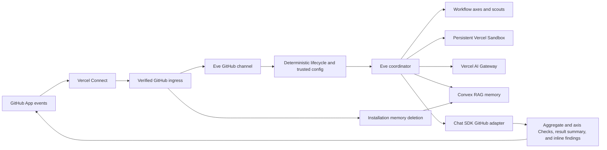

# Architecture

## Runtime boundaries

The native Eve GitHub route remains the only inbound webhook path. A thin route
decorator recognizes GitHub App installation lifecycle payloads, verifies them
with Eve's existing Connect OIDC verifier, and sends cleanup admission directly
to Convex. Every other request is delegated unchanged to Eve, which creates one
durable session per PR conversation, checks out the current PR without exposing
the installation token, and uses `steer` to cancel stale turns.

The official Chat SDK GitHub adapter is instantiated with the same Connect
connector and a webhook-specific installation ID. This application uses its
typed Octokit escape hatch because GitHub Checks are not a generic chat
operation. It does not register the adapter's webhook route.

## Admission and dispatch

Before a model can run, the channel fetches current PR metadata, reads config at
the base SHA, validates its closed schema, lists current PR files, decodes the
GitHub-owned baseline, computes the effective patch, and chooses exactly one
lifecycle plan. Invalid config and lost state create a failed Check directly.
Semantic no-ops reuse the prior v2 artifact directly. Neither path invokes a
model.

For model-backed paths, the channel writes the trusted base/head/config/plan
into Eve auth attributes and adds a review envelope to context. Publication
tools accept no report or target from the model. They load a validated staged
report whose repository, PR, base, head, patch, and plan match trusted context.

## Review execution

Slop Sheriff selects a locally authored role policy for each Eve turn. The
existing authored workflow maps trusted active axes one-to-one to Eve root
copies, preserving their shared sandbox, signed checkpoints and bounded scout
continuations. Content-based triage always retains the broad engineering-quality
core, including claim alignment and reuse. Specialists activate for concrete
review needs: changed behavior, public contracts, dependencies/shared abstractions,
authored prose, tests and consequential risks. Public surfaces retain discoverability.
Incomplete or unfamiliar patches widen the specialist selection. Decisions and
reasons are bound to the trusted plan; skipped reasons reach canonical coverage.
A test-against-spec lane records explicit-requirement behavior through real
interfaces; a writing lane inspects changed prose, UI strings and comments.
A conditional test-health lane inspects changed or affected tests as a frozen
external contract: establish consumer expectations before the implementation,
then check meaningful public outcomes, failure sensitivity and tolerance of
behavior-preserving refactors. It never derives expectations from the current
implementation or changes tests to make observed behavior pass. Engineering
quality retains its existing test-value coverage; spec testing judges product
behavior, while test health judges the independence and reliability of tests.

Eve 0.52.5 resolves turn instructions before appending the incoming child
message. The first child turn therefore receives fixed child authority and
the exact application-authored task policy in its routed dispatch message.
Later turns can select the durable bound role. Coordinator procedure never
enters first-child system context. The deterministic runtime smoke imports the
production resolver and verifies this lifecycle against the native mock model.

Specialist packets preserve every manifest index and its coverage obligation.
Spec packets include potential specification patches and implementation
metadata; omitted patches never establish behavioral success. Writing packets
omit known binary/lock payloads while retaining explicit classification work.
Test-health packets include potential test and contract sources, with metadata
for implementation/dependency entries and an obligation to locate affected
consumer-facing tests.
Every completed specialist report classifies all manifest entries with
passed, failed, unverified or out-of-scope evidence. Failed and unverified
results remain in canonical probes and limitations through deterministic
assembly. Core packets still include the complete classified review scope.
The sixteen-dispatch limit includes new lanes and continuations; exhaustion
fails closed without reducing coverage or silently raising the limit.

After the root revalidates the exact PR
head, an Eve `action.result` hook performs one application-owned preparation
phase without putting preparation commands or raw patches in model history.
Its immutable ledger binds the trusted repository, pull request, base, head,
patch, plan, and execution revision to component digests for the classified
patch, capability inventory, exact-head GitHub Checks, workflow artifacts,
common probes, and typed gaps. The same ledger records stable content-derived
identities for shared patch preparation, capability discovery, exact-head
evidence, repository history, repository memory, and probes. Prepared memory
contains only normalized findings and provenance; prepared history contains
only revision identities and paths.

The trusted application boundary lists Checks and workflow runs at the exact
head. It accepts only unexpired artifact archives whose workflow repository,
head repository, head SHA, run identity, and SHA-256 digest match GitHub
metadata. Validated archives enter only the credential-free sandbox as
untrusted data and are never executed. Missing artifacts remain availability
metadata; local execution can supply the required behavioral evidence. Stale, mismatched, or unavailable
application-owned evidence fails closed before lanes run.

Every lane receives the same ledger digest with its bounded evidence packet
instead of probing shared evidence again. Lanes page an integrity-checked
manifest and bounded patch chunks instead of independently reconstructing the
diff. Their checkpoints bind the ledger digest, while axis-specific source,
history, test, and probe investigation remains available. Child routing
envelopes contain an exact skill axis or the `revalidation` or `scout` role.
Dynamic model routing maps these roles directly to trusted `agents`
configuration.

AI Gateway receives the first model and its ordered `models` fallback array.
The Gateway generation lookup records the actual model and provider that
served the response, including when a fallback succeeded.

Every active axis is a fresh invocation and every attempt-zero axis starts in
one concurrent fan-out as soon as application-owned preparation completes.
No axis waits for claim-and-specification or provider cache creation. Eve and
AI Gateway may still cache stable prefixes automatically, but caching does not
control scheduling. Every lane packet carries the same stable common-work
identities and prepared results. Axis-specific investigation and continuation
checkpoints remain independent. Prepared repository memory is advisory evidence
that each axis must revalidate against the current pull request.

Each lane writes one compact schema-v3 checkpoint before it returns. A complete
checkpoint owns a strict typed terminal report of its scope, coverage, churn,
probes, candidates, verified claims, and limitations, and prevents duplicate
work; the authored `workflow` tool returns only completion receipts. Lane candidates contain
evidence and remediation facts but no severity, category, status, identifier,
or verdict. An incomplete checkpoint records reviewed and remaining manifest
entry indexes, reproduced observations, next steps, and limitations. The same
authored Eve workflow starts a fresh built-in subagent that reconciles that
packet with the immutable manifest, without inheriting the prior model history.
This reuses the checkpoint-and-reconcile semantics of Milestone Rush; it does
not introduce another workflow runtime or state service.

Application code owns the lane/scout loop through `defineWorkflowTool` and
`ctx.agent`. Trusted session context fixes axes, identity and plan. The model
supplies one bounded common claim/context field, treated as a hypothesis below
that authority. Each lane copies an application-issued checkpoint attestation
into its strict native task result. The attestation binds the signed checkpoint
to the root session, native invocation, axis, attempt, revision and review
identity. Only a fresh write can authorize incomplete continuation. Complete
checkpoint reads support authorized recovery without repeating investigation.

Attestations establish what the checkpoint tool validated; they do not replace
current sandbox reads. Existing recovery and report assembly still require
every actual signed terminal checkpoint before publication. The workflow
cannot access the sandbox in Eve 0.52.5, and its partial progress events bypass
application hooks. Sandbox authority therefore stays in ordinary tools.

Sixteen logical child dispatches are allowed per workflow invocation, matching
the former experimental tool. Native keys stabilize replay within a run; a
native hook lock rejects competing active workflow runs for the same root.
Both orchestration APIs share Eve's at-least-once child-start path. This does
not promise exactly-once physical execution, a session-wide dispatch budget,
or recovery across an untested process crash. A failed child never triggers
an application retry or a partial verdict.

When a lane needs bounded related-source, history, rendered-page, or web
evidence, the coordinator starts a fresh routed scout and passes its compact
evidence to the next fresh lane. Selected-finding outcomes are persisted before
report assembly. After all typed axis reports pass application validation, the
coordinator filters candidates, reconciles duplicates and conflicts, and
assigns severity and category through the strict assembly contract. Typed
application code then coalesces duplicate fresh identities, merges prior and
fresh findings, sets fresh findings open, derives skipped-axis coverage,
preserves stable prior IDs, assigns new IDs, injects trusted review identity,
derives the verdict, validates the v2 report, and stages it beside the
unchanged baseline. The app then derives exact-copy
text and code segments deterministically from canonical finding text, location
paths, and symbols.

Eve compacts a lane at 25 percent of the selected model's context window. The
percentage adapts to arbitrary Gateway models while leaving enough room for a
large evidence chunk, related source, and probe output. Compaction and fresh
checkpoint continuation preserve review depth; neither is a completion gate.

## Repository memory

Successful full and delta publication queues an idempotent Convex ingestion;
publication never waits for embedding completion. Convex schedules bounded
retries and stores normalized outcomes in an `@convex-dev/rag` namespace keyed
by immutable GitHub repository ID. Prompts, patches, source, model responses,
credentials, and probe output are never stored.

Repositories start in bootstrap mode. Adaptive short, mid, and long tiers
activate only after the confirmed age, review-count, review-day, and span
gates. Retrieval post-ranks semantic matches by recency tier, severity, open
state, and distinct-PR recurrence. New memories reuse their one generated
embedding for both RAG storage and nearest-cluster assignment. Later ingestions
reuse a ready RAG entry when its text hash and embedding configuration match.
Search joins its vector identity to current application records for outcome,
severity, timestamp and provenance; orphaned and superseded entries are excluded.
Older metadata-inclusive hashes are replaced on the next ingestion. Short-term
matches remain individual, mid-term retrieval keeps up to two representatives
per semantic cluster, and long-term retrieval keeps one. The clustering score
and tier caps live in the hashed memory policy for deterministic replay and
explicit tuning. A current review always owns the verdict.

An embedding-model change builds a pending RAG namespace while the active
namespace continues serving reads, then promotes the replacement atomically.
Pages and retries have durable job identities and an 11-minute expiry. Ready
ingestions on the active model drain before another migration claims work,
preventing queued configurations from repeatedly switching before ingestion.

Admission receipts come from a persistent installation/repository access record
created before a fresh native GitHub installation-access check. Removal advances
its generation before asynchronous cleanup. Ingestion requires the current
receipt; deleting content never deletes this revocation barrier. Re-adding a
repository permits a newly checked receipt, while a complete uninstall blocks
that installation ID. These access and delivery records contain identifiers
only. Previously running sessions without a receipt skip memory ingestion.
Access checks stop once the repository is found and have a five-second deadline;
full lifecycle reconciliation enumerates all pages within fifteen seconds.

Native delivery IDs deduplicate webhook redelivery. Headerless forwarded events
use an application job ID; current access is checked for every removal event.
Reconciliation pages through access registrations and stored repositories, so a
review registered before its first memory write is still revoked. Cleanup jobs
are bound to the original repository document ID and resume after abandoned
actions. They drain writers, delete every RAG namespace version through the
component's native API, then delete application rows. This also removes orphan
entries left by a crash between RAG insertion and saving the app's vector row.

## State and publication

An accepted model-backed review creates or updates an active current-head
aggregate Check and one Check per active axis as `in_progress`; conditional
axes are `skipped`. A rerun after completion creates fresh same-name Checks
because a completed run is terminal. Manual comment triggers receive an
eyes reaction from the webhook handler while it still owns the exact triggering
comment. Completion moves the active Check Run to its final verdict.

The validated report is written into `pendingPublication` before any visible
review is submitted. That state is bound to the exact trusted review identity
and coexists with the last successful baseline. A publication failure therefore
leaves the prior baseline intact and gives `@slop-sheriff continue` one
application-only operation: reload the staged report and retry GitHub. It does
not start an Eve coordinator turn, lane, or revalidation worker.

Every successful publication also updates one visible PR summary containing the
result and a hidden canonical state schema v2 artifact, baseline head,
whole-patch fingerprint, and per-file fingerprints. Findings use native inline
review threads at their exact diff locations. Hidden semantic fingerprints,
derived from the canonical cause, invariant, and remedy, own reconciliation;
`CR-N` is the readable canonical report identifier. Application-owned baseline
aliases preserve original thread hashes across trusted delta revalidation; full
reviews cannot borrow unrelated CR numbers. A verified fixed finding receives
a brief evidence-and-commit reply before its bot-owned thread resolves. Runtime
requirements survive deferred revalidation. Hidden or unmatched findings and
human threads stay open. Replacement threads are submitted before moved-thread
cleanup. Per-thread failures preserve staged state and prevent completion;
retries inspect existing replies and resolution state without repeating them.
Inline findings use the shared Markdown/HTML formatter, at most 100 words with
an optional short cowboy opener and a final Impact line of at most 300 characters.
Assembly rejects overlong wording before persistence so the model can revise it.
The compact main summary collapses out-of-scope coverage, while Check Runs and
the canonical artifact retain detailed evidence. Check lookup is scoped to the current head and
fixed aggregate and axis names.

State uses a single comment when it fits, gzip when necessary, then immutable
digest-addressed parts when compressed state needs multiple comments. Parts must
all exist before the summary pointer changes; failed writes preserve the previous
baseline, and retries reuse existing parts. Each comment is bounded to 65,000
bytes, serialized state to 8 MiB, and compressed storage to 64 parts of 60,000
characters. Invalid or oversized state and inline findings fail before advancing
the baseline. A completed or failed Eve
turn that did not publish a validated artifact becomes a failed Check; an
initial failure marks the baseline lost so a later webhook cannot silently run
a second full review.

A current-head failure also records a bounded, sanitized envelope beside the
unchanged successful baseline. It binds the failed stage and completed axes to
the trusted base, head, effective patch, plan, session, turn, and recovery
revision. Schema failures retain bounded issue codes and field paths without
input values. Authorized continuation reuses only matching durable state and
lane checkpoints; token-limit failures remain ineligible.

## Sandbox and telemetry

The Vercel/microsandbox backends allow GitHub and public dependency/toolchain
download domains, with private IPv4 ranges denied. Docker fallback is offline because it cannot broker per-domain
credentials. GitHub checkout authentication stays in the firewall; no token is
placed in the sandbox.

Eve caches bootstrap tools in its sandbox template. Exact-head preparation
serializes checkout and dependency setup for the shared sandbox, removes stale
ignored dependencies, installs declared runtimes and locked packages, and checks
browser startup when required. Its receipt binds the head, declaration hashes,
completed steps and observed versions into capability evidence. Setup failures
stop dispatch; missing installable tools are not successful coverage gaps. The
runtime revision key replaces stale templates when the bootstrap changes.

Each turn stops sandbox compute. The durable filesystem is resumed for the
next delta. A close/merge operation removes `/workspace` contents and stops the
sandbox. The GitHub state artifact remains so review history is auditable.

OpenTelemetry inputs and outputs are disabled. Eve emits its normal structural
run tags, while the metadata hook records Gateway generation model/provider,
tokens, cache tokens, exact USD cost, generation time, latency, outcome, and
review kind. Offline replay deduplicates measurements by Agent Run, session,
and generation identity, then compares recorded and candidate phases without
using any measurement as an acceptance gate. Generation lookup failures are
visible but do not expose prompts or source. Each metadata request has a
five-second timeout; unresolved records remain pending. Completed, failed and
cancelled turns release their transient tracking and flush observed usage.

The application uses Eve's native root input quota: 40,000,000 provider-reported
tokens in installed Eve 0.52.5. The separate output guard remains 512,000 tokens.
Child sessions receive shares of the root's remaining quota, and their completed
usage is charged back to the root. The former 8,000,000 input override stopped
PR42's coordinator at 10,283,914 tokens after all seven lanes had completed,
before reconciliation could run. A deterministic native Eve test now replays
that descendant usage and verifies the coordinator can execute its next tool
and finish. It replaces tests that merely repeated local budget arithmetic.
The quota is an execution guard, not a review-quality or performance target.
Every selected lane and coverage obligation still has to complete.
Cached input is a subset reported separately for telemetry, not an amount added
again to input usage. Fresh full and delta roots run in task mode so the cap
cannot be renewed through a conversation continuation. Exhaustion publishes an
`action_required` Check with measured usage and the configured cap, publishes
no partial verdict, and never retries automatically. Input telemetry also
evaluates 2M, 3M, 4M, and 6M comparison thresholds during the provisional
rollout.
